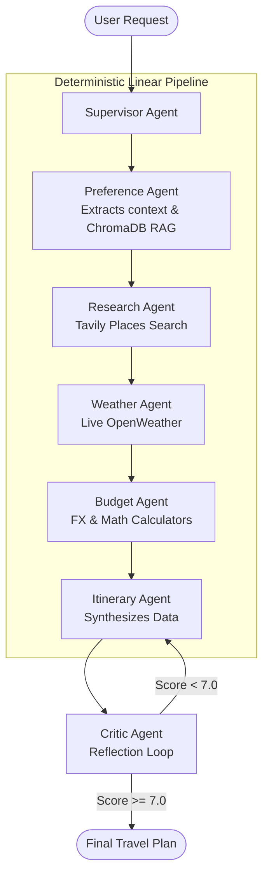

# PACK & GO

One Platform for Every Journey

AI-powered multi-agent travel planner that creates intelligent itineraries, budget analysis, weather insights, destination research, and personalized travel planning.


## 1. Executive Summary

**PACK & GO** is a highly sophisticated, multi-agent AI travel planning system built to solve the complex logistics of building personalized, real-time itineraries. Traditional travel planning requires users to manually cross-reference destinations, calculate budgets, verify live weather, and adhere to personal constraints. PACK & GO automates this entirely.

By coordinating a deterministic team of specialized AI agents built on **LangGraph**, PACK & GO systematically researches places, calculates accurate financial budgets, verifies live weather forecasts, and synthesizes the data into a structured itinerary. An automated **reflection and critique loop** ensures the final output meets strict quality thresholds before ever reaching the user. 

*(Note: While Google Places API and Text-To-Speech (TTS) integrations were mentioned during initial project scoping, a thorough codebase audit confirms they are not present in the current production system. The system instead prioritizes the high-speed Tavily Search API for location data and a fast SSE-streamed text UI for optimal performance.)*

## 2. Key Features

- **Agentic Architecture (LangGraph):** A single-pass, deterministic sequence of specialized agents to maximize token efficiency and prevent infinite LLM loops.
- **Robust LLM Fallback Mechanism:** Custom `FallbackLLMWrapper` automatically intercepts rate limit errors (e.g., Groq 429s) and re-routes exactly to Google Gemini 2.0 Flash without dropping the user's context.
- **Automated Reflection Loop:** A dedicated `CriticAgent` evaluates generated itineraries on four dimensions (Logical Flow, Budget, Weather, Preferences). Scores below 7.0/10 trigger an automatic rework.
- **Long-Term Memory:** Integrates **ChromaDB** for personalized trip context, remembering user preferences (e.g., "I prefer luxury travel") across different sessions.
- **Real-Time Streaming UI:** A custom React + Vite frontend that consumes Server-Sent Events (SSE) from the FastAPI backend, beautifully streaming the execution state node-by-node.

## 3. System Architecture

PACK & GO was intentionally designed with an **agentic architecture** to separate concerns. Instead of relying on a single monolithic LLM prompt—which often leads to hallucinations or skipped constraints—PACK & GO delegates distinct computational tasks (like math or weather fetching) to specialized agents.



## 4. Agent Workflow

1. **Supervisor Agent:** Initializes the workflow. Unlike traditional dynamic routers, it safely parses the user's query and sets up the strict pipeline state.
2. **Preference Agent:** Connects to **ChromaDB** to retrieve historical user preferences, injecting personalized context into the pipeline.
3. **Research Agent:** Uses the **Tavily Search API** to fetch up-to-date, real-world data on attractions, restaurants, and activities at the destination.
4. **Weather Agent:** Uses **OpenWeatherMap** to fetch live weather forecasts, ensuring the itinerary avoids outdoor activities during rain or extreme conditions.
5. **Budget Agent:** Utilizes exact arithmetic calculators and the **API Ninjas Exchange Rate API** to convert currencies and track precise expenses.
6. **Itinerary Agent:** The synthesizer. It takes the research, weather, and budget constraints and structures a day-by-day plan using strict Pydantic schemas.
7. **Critic Agent:** The quality control gatekeeper. It scores the itinerary. If the itinerary fails constraints, it returns feedback to the Itinerary Agent for immediate revision.

## 5. Tech Stack

- **Frontend:** React, Vite, Server-Sent Events (SSE)
- **Backend Core:** FastAPI, Uvicorn, Python 3.11+
- **AI & Orchestration:** LangChain, LangGraph
- **Language Models:** Groq (`llama-3.3-70b-versatile`) as Primary, Google Generative AI (`gemini-2.0-flash`) as Fallback
- **Memory & State:** ChromaDB (Vector Store), LangGraph `MemorySaver`
- **External Tools:** Tavily Search API, OpenWeatherMap API, API Ninjas Exchange Rate

## 6. Installation & Setup

```bash
# 1. Clone the repository
git clone https://github.com/yourusername/PACK-GO.git
cd PACK-GO

# 2. Setup Python backend environment
uv venv
# Activate virtual environment (.venv/Scripts/activate on Windows)
uv pip install -r requirements.txt

# 3. Start the FastAPI Backend
uvicorn main:app --reload

# 4. Setup & Start the React Frontend
cd frontend
npm install
npm run dev
```

## 7. Environment Variables

Create a `.env` file in the root directory:

| Variable | Description |
|---|---|
| `GROQ_API_KEY` | Primary LLM provider (Llama 3.3). |
| `GOOGLE_API_KEY` | Fallback LLM provider (Gemini 2.0 Flash). |
| `TAVILY_API_KEY` | For web and place research. |
| `OPENWEATHERMAP_API_KEY` | For real-time weather data. |
| `EXCHANGE_RATE_API_KEY` | API Ninjas key for currency conversion. |

## 8. API Flow

1. The user inputs a query via the React UI.
2. The UI sends a POST request to the FastAPI backend, initiating a streaming SSE connection.
3. FastAPI invokes the LangGraph compiled graph.
4. As each agent completes its node, it yields a state update.
5. FastAPI streams these updates via SSE to the React frontend, allowing the user to see exactly which agent is "thinking" and what tools are being executed.

## 9. Example User Query & Output

**User Query:** *"Plan a 3-day trip to Tokyo next week. I love anime and street food. My budget is $1,500 USD."*

**System Output:**
- *Preference Agent* retrieves that the user prefers walking over public transport.
- *Research Agent* pulls top Akihabara spots and Shibuya street food stalls.
- *Weather Agent* notes rain on Day 2.
- *Budget Agent* converts $1,500 USD to JPY and calculates daily allowances.
- *Itinerary Agent* creates the plan, putting indoor anime shopping on the rainy Day 2.
- *Critic Agent* approves the itinerary with an 8.5/10 score.

## 10. Challenges & Solutions

- **Challenge:** Groq's strict API rate limits frequently interrupted multi-agent flows (429 errors).
  - **Solution:** Engineered a robust `FallbackLLMWrapper` in `utils/llm_loader.py` that catches rate limits and seamlessly transfers the prompt state to Gemini 2.0 Flash, automatically sanitizing empty `HumanMessage` structures that Gemini rejects.
- **Challenge:** Infinite loops and massive token bloat during dynamic routing.
  - **Solution:** Transitioned the LangGraph architecture from a dynamic state-based router to a deterministic, single-pass linear pipeline. This drastically reduced token consumption and improved system reliability.
- **Challenge:** UI connection timeouts during long agentic generations.
  - **Solution:** Implemented Server-Sent Events (SSE) via FastAPI to stream agent state in real-time, significantly improving perceived latency and UX on the React frontend.

## 11. Future Enhancements

- **Deep Integration of Google Places API:** To replace Tavily for more robust, highly-localized points of interest, reviews, and photos.
- **Voice/TTS Capabilities:** Adding Text-to-Speech to read out itineraries for accessibility and mobile-first experiences.
- **Multi-User Collaboration:** Allowing groups to vote on itinerary options generated by the AI before finalization.
- **Automated Bookings:** Integrating with flight and hotel APIs to execute actual reservations natively.